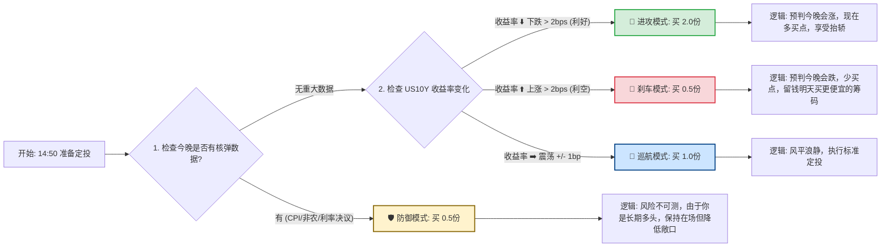

```mermaid
graph LR
    %% 布局改为 LR (从左到右)，看起来更舒服
    Start["开始: 14:50 准备定投"] --> CheckCalendar{"1. 检查今晚是否有核弹数据?"}
    
    CheckCalendar -- "有 (CPI/非农/利率决议)" --> Defensive["🛡️ 防御模式: 买 0.5份"]
    CheckCalendar -- "无重大数据" --> CheckUS10Y{"2. 检查 US10Y 收益率变化"}
    
    CheckUS10Y -- "收益率 ⬇️ 下跌 > 2bps (利好)" --> Aggressive["🚀 进攻模式: 买 2.0份"]
    CheckUS10Y -- "收益率 ⬆️ 上涨 > 2bps (利空)" --> Conservative["🛑 刹车模式: 买 0.5份"]
    CheckUS10Y -- "收益率 ➡️ 震荡 +/- 1bp" --> Standard["🚗 巡航模式: 买 1.0份"]
    
    Aggressive --> Why1["逻辑: 预判今晚会涨，现在多买点，享受抬轿"]
    Conservative --> Why2["逻辑: 预判今晚会跌，少买点，留钱明天买更便宜的筹码"]
    Standard --> Why3["逻辑: 风平浪静，执行标准定投"]
    Defensive --> Why4["逻辑: 风险不可测，由于你是长期多头，保持在场但降低敞口"]
    
    %% 你的配色很棒，保留不动
    style Aggressive fill:#d4edda,stroke:#28a745,stroke-width:2px
    style Conservative fill:#f8d7da,stroke:#dc3545,stroke-width:2px
    style Standard fill:#cce5ff,stroke:#004085,stroke-width:2px
    style Defensive fill:#fff3cd,stroke:#856404,stroke-width:2px
```